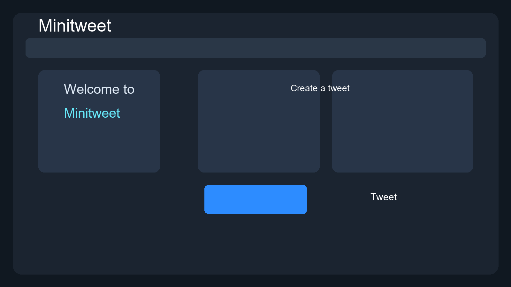

# TwitterMini

A small Django mini social app created to learn Django basics like models, views, templates, auth, and CRUD.

## Preview



## Features

- Create tweet posts
- Edit and delete tweets
- User registration and login
- Logout flow
- Bootstrap-based UI

## Tech Stack

- Python
- Django
- SQLite
- Bootstrap

## Run locally

```bash
git clone https://github.com/Ny-ho/TwitterMini.git
cd TwitterMini
python -m venv .venv
source .venv/bin/activate   # Windows: .venv\Scripts\activate
pip install -r requirements.txt
python manage.py migrate
python manage.py runserver
```

Open: http://127.0.0.1:8000/
